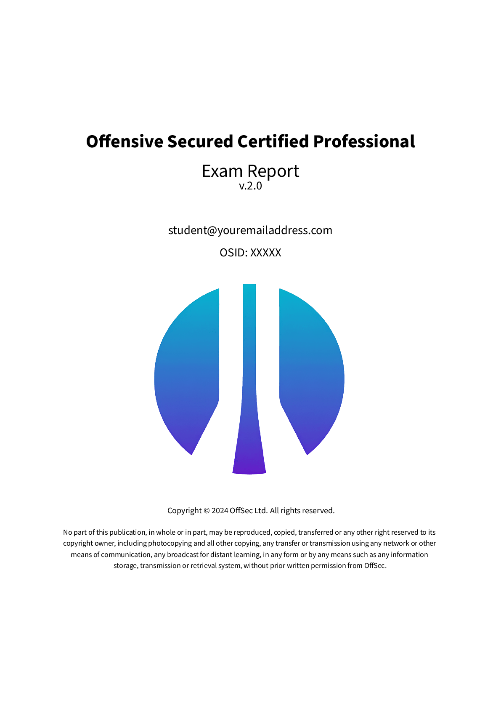
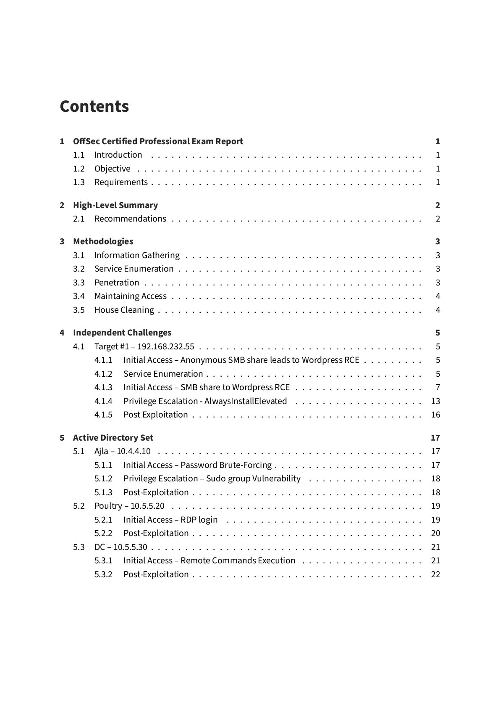
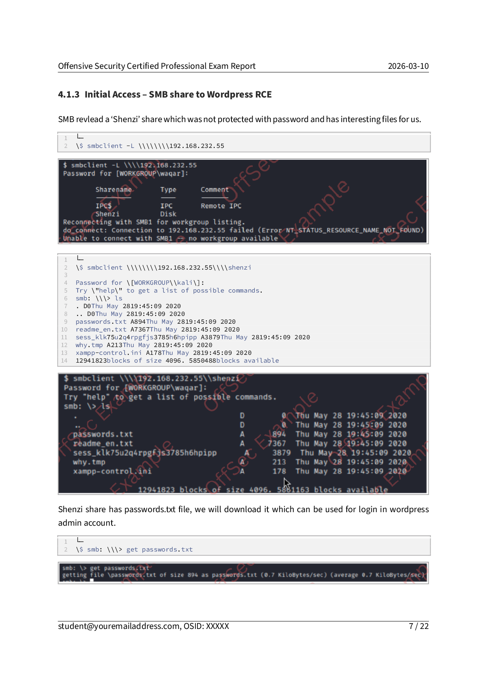
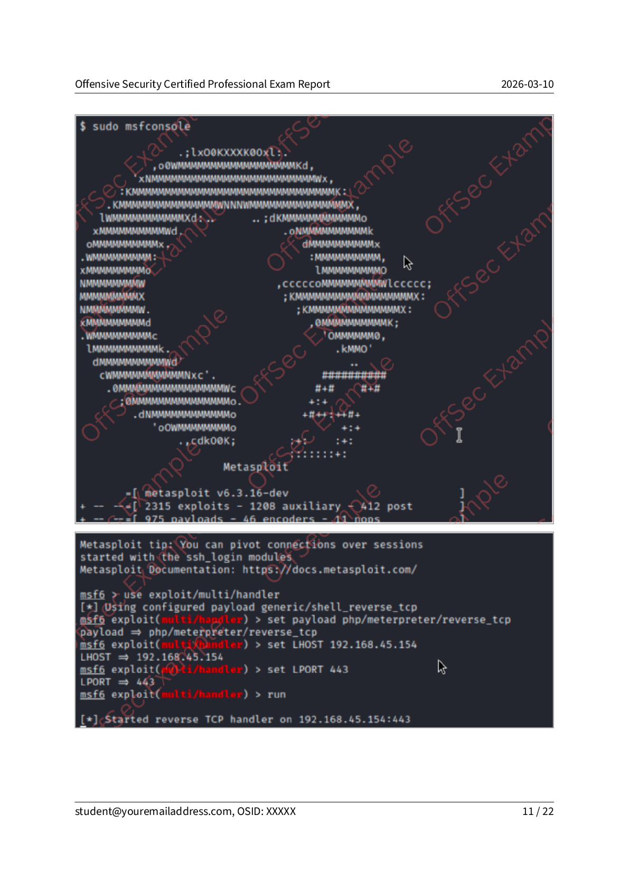
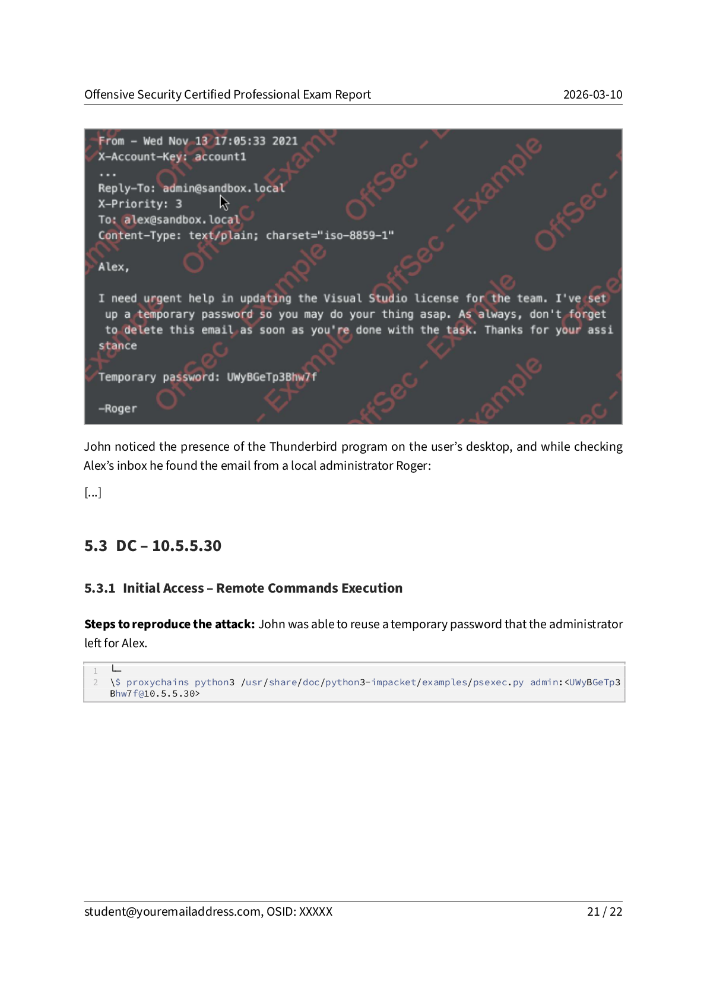
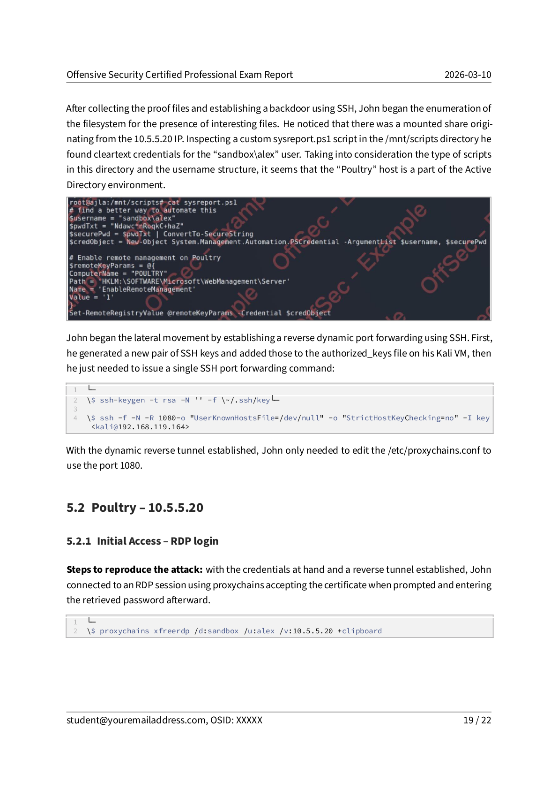

# OSCP Exam Report Template - o5Cn

This fork is based on [noraj/OSCP-Exam-Report-Template-Markdown](https://github.com/noraj/OSCP-Exam-Report-Template-Markdown), focused on a practical workflow for the official OffSec OSCP v2.0 report style.

## 🔎 Upstream Reference

- Upstream project: [noraj/OSCP-Exam-Report-Template-Markdown](https://github.com/noraj/OSCP-Exam-Report-Template-Markdown)
- Base PDF template: [Wandmalfarbe/eisvogel](https://github.com/Wandmalfarbe/pandoc-latex-template)

## ✨ What This Fork Adds

- Local Eisvogel template versioned in `src/templates/eisvogel.latex`
- Local OffSec cover logo in `src/img/offsec-learning-partner.png`
- Better relative image path support (relative to input `.md`)
- OffSec-like cover page and footer style
- Page numbering starts on main content (not cover/TOC)
- Code blocks with border, light background, line numbers, wrapping
- Inline code styling
- Images with fixed border (1px-like), no shadow
- Long URL wrapping inside margins
- Docker workflow for isolated generation

## 🖼️ Preview Gallery (2x3)

<table>
  <tr>
    <td></td>
    <td></td>
    <td></td>
  </tr>
  <tr>
    <td></td>
    <td></td>
    <td></td>
  </tr>
</table>

## 📁 Included OffSec OSCP Exam Report v2.0 Markdown Example

This repository includes a DOCX->Markdown converted example from official Offsec OSCP Exam Report template, already organized with everything in one folder:

- `src/OSCP-exam-report-template_OS_v2-markdown/OSCP-Exam-Report-From-DOCX.md`
- Rendered sample PDF: `output/examples/OSCP-exam-report-template_OS_v2.pdf`

## 🧰 Usage Mode 1: Native Dependencies

```bash
ruby osert.rb init
ruby osert.rb generate
```

Direct mode:

```bash
ruby osert.rb generate \
  -i /path/to/Report.md \
  -o /path/to/output \
  -e OSCP \
  -s OS-12345678
```

## 🐳 Usage Mode 2: Docker (Recommended)

Use the prebuilt Docker Hub image (recommended):

```bash
docker pull oswaldocostaneto/oscp-report-template:latest
```

Run with a Markdown file inside your current repository:

```bash
printf 'n\nn\n' | docker run --rm -i \
  -v "$PWD":/workspace \
  oswaldocostaneto/oscp-report-template:latest generate \
  -i path/to/your/markdown-file.md \
  -o output \
  -e OSCP \
  -s OS-12345678
```

You can generate the included OSCP Exam Report v2.0 example to test quickly:

```bash
printf 'n\nn\n' | docker run --rm -i \
  -v "$PWD":/workspace \
  oswaldocostaneto/oscp-report-template:latest generate \
  -i src/OSCP-exam-report-template_OS_v2-markdown/OSCP-Exam-Report-From-DOCX.md \
  -o output \
  -e OSCP \
  -s OS-12345678
```

Parameters explained:

- `-v "$PWD":/workspace`: mounts your current folder into container
- `-i`: input Markdown path (relative to your repo root, or absolute container path)
- `-o`: output directory (relative to your repo root, or absolute container path)
- `-e`: certification (this fork is focused only on `OSCP` mode)
- `-s`: OSID used in output file naming

Important:

- The script asks OSID again in CLI mode only if `-s` is not provided.
- `-s` controls output filename naming.
- The two `n` answers skip PDF preview and external lab report prompt.

Use a report outside current repo:

```bash
printf 'n\nn\n' | docker run --rm -i \
  -v "$PWD":/workspace \
  -v "/home/user/reports":/reports \
  oswaldocostaneto/oscp-report-template:latest generate \
  -i /reports/Report.md \
  -o output \
  -e OSCP \
  -s OS-12345678
```

### Secondary Option: Build Image Locally

```bash
docker build -t oscp-report-template:local .
```

```bash
printf 'n\nn\n' | docker run --rm -i \
  -v "$PWD":/workspace \
  oscp-report-template:local generate \
  -i src/OSCP-exam-report-template_OS_v2-markdown/OSCP-Exam-Report-From-DOCX.md \
  -o output \
  -e OSCP \
  -s OS-12345678
```

## 🚀 Docker Hub Multi-Platform Publish

Automated publishing is configured in:

- `.github/workflows/docker-publish.yml`

Workflow publishes these platforms:

- `linux/amd64`
- `linux/arm64`
- `linux/arm/v7`

Platform notes:

- macOS Intel and Apple Silicon: supported
- Linux x64 and ARM: supported
- Windows x64 and ARM: supported via Docker Desktop/WSL2 with Linux containers
- Native Windows container images (`windows/amd64`, `windows/arm64`): not supported by this Ubuntu-based image

## 📝 Markdown Metadata Quick Guide

The report content shown inside the PDF (title, email, OSID, etc.) comes from YAML front matter in the Markdown file.

Example:

```yaml
---
title: "Offensive Security Certified Professional Exam Report"
author:
  - "student@youremailaddress.com"
  - "OSID: XXXXX"
date: "2026-03-10"
subject: "OSCP"
lang: "en"
titlepage: true
book: true
---
```

Quick mapping:

- `author[0]`: student email shown in report
- `author[1]`: OSID shown in report body/footer
- `date`: report date shown in header/title page
- `subject`: exam context metadata
